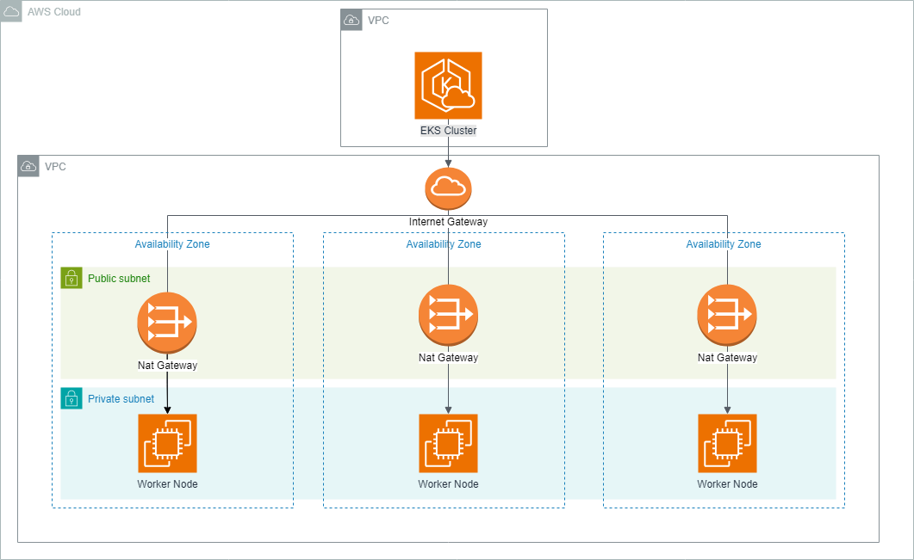

# AWS EKS Flask API Application

## Overview
This project deploys a Flask-based API application on AWS EKS, demonstrating containerized application development and deployment on a managed Kubernetes service. It integrates CI/CD workflows, infrastructure as code, and container orchestration.

## Architecture
The application is containerized using Docker, orchestrated with Kubernetes on AWS EKS, with infrastructure managed through Terraform.

## EKS Cluster Architecture

## Technologies
- AWS EKS
- Docker
- Kubernetes
- Terraform
- Flask (Python)

